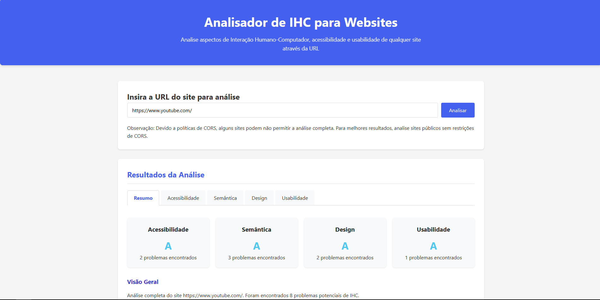

# 🌐 IHC Analyzer – Ferramenta de Análise de Interfaces  

  

**🔎 Uma ferramenta open source para analisar acessibilidade, usabilidade e boas práticas de IHC em qualquer site.**  

[🚀 **Acesse a Demo**](https://tcigualchi.github.io/ihc-viewer/)  

---


---

## ⚡ Funcionalidades

### ♿ Acessibilidade  
- ✅ Verificação de contraste de cores (WCAG)  
- ✅ Formulários acessíveis com `label`, `aria-*`, e `role`  
- ✅ Validação de atributos ARIA  

### 🧱 Semântica  
- ✅ Uso correto de tags como `<header>`, `<main>`, `<footer>`  
- ✅ Análise de hierarquia de cabeçalhos (`h1` a `h6`)  
- ✅ Verificação de `alt` em imagens  
- ✅ Checagem de links acessíveis  

### 🎨 Design  
- ✅ Tamanhos de fonte adequados e legíveis  
- ✅ Layout responsivo com `meta viewport` e unidades relativas  
- ✅ Verificação de espaçamento e alinhamento  

### 🧭 Usabilidade  
- ✅ Títulos de página descritivos  
- ✅ Presença de favicon  
- ✅ Identificação de scripts bloqueantes  

---

## 🛠 Tecnologias Utilizadas

- **Frontend:** HTML5 + CSS3 + JavaScript (Vanilla)  
- **Proxy Backend:** Cloudflare Workers *(para contornar CORS)*  
- **Hospedagem:** GitHub Pages  

---

## 🧪 Como Usar

```bash
1. Acesse: https://tcigualchi.github.io/ihc-viewer/
2. Insira a URL do site que deseja analisar
3. Clique em "Analisar" e visualize o relatório gerado
```

---

## 📁 Estrutura do Projeto

```
ihc-analyzer/
├── index.html         # Página principal
├── css/
│   └── style.css      # Estilos visuais
├── js/
│   └── script.js      # Lógica de análise
└── README.md          # Documentação do projeto
```

---

## ⚠️ Limitações

- 🌐 Alguns sites podem bloquear a análise devido à política de CORS  
- ⛔ O proxy gratuito do Cloudflare tem limite de **100.000 requisições/dia**  

---

## 🤝 Contribuindo

Contribuições são super bem-vindas!  

```bash
1. Faça um fork deste repositório
2. Crie uma branch: git checkout -b feature/sua-funcionalidade
3. Commit suas alterações: git commit -m 'Adiciona nova funcionalidade'
4. Envie sua branch: git push origin feature/sua-funcionalidade
5. Abra um Pull Request ✨
```

---

## 📜 Licença

Distribuído sob a licença MIT.  
© [João Victor Gualchi](https://github.com/tcigualchi)

---

## 🔗 Teste Agora

👉 [**Clique aqui para acessar a ferramenta**](https://tcigualchi.github.io/ihc-viewer/)
